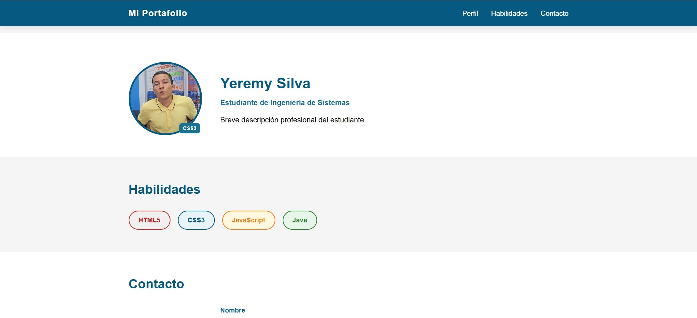

# Yeremy Silva

## Descripción del proyecto
Este proyecto es una página web de perfil personal desarrollada con HTML5 y CSS3. Incluye:

- Encabezado fijo con navegación interna.
- Sección de perfil con foto, nombre y descripción.
- Sección de habilidades con etiquetas de tecnologías.
- Formulario de contacto con estilos visuales y enfoque en accesibilidad.

## Instrucciones para abrirlo localmente
1. Abre esta carpeta del proyecto en Visual Studio Code.
2. Abre el archivo `index.html`.

### Opción 1: Menú contextual
1. Haz clic derecho sobre `index.html`.
2. Selecciona **Open with Live Server**.

### Opción 2: Botón en la barra inferior
1. Abre tu archivo `index.html`.
2. En la barra de estado (parte inferior de VS Code), haz clic en **Go Live**.

En ambos casos, el sitio se abrirá en el navegador local.

## Captura de pantalla del resultado final

